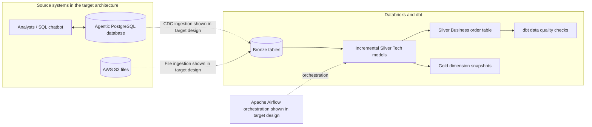

# DMart Data Pipeline

An analytics engineering project that transforms DMart retail data with dbt and Databricks. The project is organized into incremental Silver models, a business-facing order table, data quality checks, and timestamp-based Gold snapshots.

> **Architecture note:** The diagram below is a GitHub-renderable version of the architecture image shared for this project. It distinguishes the dbt transformations present in this repository from the upstream ingestion and orchestration components shown as part of the wider target design.

## Architecture



### What is implemented here

- **Databricks source definitions** for the `dmart.bronze` tables.
- **Silver Tech incremental models** for customers, employees, orders, order items, products, and stores.
- **Silver Business model** that assembles order and related entity data into a wide analytical table.
- **Gold snapshots** for customers, employees, orders, products, and stores, using timestamp change tracking.
- **Data quality checks** for key fields and the business-facing order table.

The repository contains the dbt transformation layer. The PostgreSQL chatbot, CDC/file ingestion into Bronze, and Airflow deployment shown in the target architecture are not configured or deployed by this dbt project.

## Data model

| Layer | Purpose | Implementation |
| --- | --- | --- |
| Source | Declares upstream Databricks Bronze relations | `models/source/sources.yml` |
| Silver Tech | Incrementally selects and processes each entity | `models/Silver_Tech/` |
| Silver Business | Combines order facts with customer, item, product, employee, and store attributes | `models/Silver_Business/obt_b.sql` |
| Gold | Tracks historical dimension changes | `snapshots/dim_*.yml` and `models/Gold/` |
| Quality | Checks key columns and business table records | `models/Silver_Tech/properties.yml`, `tests/` |

## Technology

- dbt Core
- dbt-databricks
- Databricks SQL Warehouse
- Python 3.12+
- `uv` for Python dependency management

## Getting started

### Prerequisites

- Python 3.12 or newer
- `uv`
- Access to the Databricks workspace, SQL Warehouse, catalog, and source tables

### Install dependencies

From the repository root:

```powershell
uv sync
```

### Configure the dbt profile

Create `%USERPROFILE%\.dbt\profiles.yml` with your workspace values. Keep credentials out of Git and use an environment variable for the token:

```yaml
Dmart_Project:
  target: dev
  outputs:
    dev:
      type: databricks
      host: <your-workspace-host>
      http_path: <your-sql-warehouse-http-path>
      catalog: dmart
      schema: dbt_schema
      threads: 1
      token: "{{ env_var('DATABRICKS_TOKEN') }}"
```

Set the token in the current PowerShell session before running dbt:

```powershell
$env:DATABRICKS_TOKEN = "<your-databricks-token>"
```

Never commit a real token or a personal `profiles.yml` file.

### Validate and run

From the repository root, activate the local virtual environment and run dbt against the project directory:

```powershell
.\.venv\Scripts\Activate.ps1
dbt debug --project-dir .\Dmart_Project
dbt parse --project-dir .\Dmart_Project
dbt build --project-dir .\Dmart_Project --target dev
```

`dbt debug` checks the profile and warehouse connection. `dbt parse` validates project configuration and the dependency graph without running transformations. `dbt build` runs selected models, snapshots, and tests against Databricks; it requires the configured source relations and appropriate permissions.

## Repository layout

```text
Dmart_Project/
  models/
    source/          # Bronze source declarations
    Silver_Tech/     # Incremental entity models and model tests
    Silver_Business/ # Business-facing order model
    Gold/            # Snapshot input models
  snapshots/         # Timestamp-based dimension snapshots
  macros/            # Project macros
  tests/             # Singular data quality tests
  dbt_project.yml
pyproject.toml        # Python and dbt dependencies
```

## Development notes

- Local dbt artifacts (`target/`, `dbt_packages/`, and logs) and local profile files are excluded from version control.
- The project has been validated with `dbt parse`. A full `dbt build` depends on access to the configured Databricks tables and has not been represented as a successful production run.
- Use feature branches for layer changes and merge completed work into `main` after validation.

## Roadmap

- Add and document the upstream CDC and file-ingestion jobs.
- Add the Airflow DAGs and deployment configuration if orchestration is in scope.
- Expand model-level descriptions, freshness checks, and business-key tests.
- Run and record an end-to-end `dbt build` against a development Databricks target.
